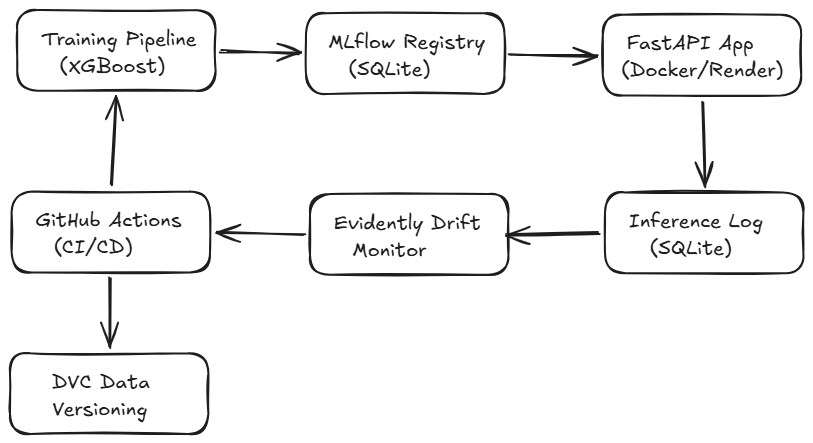
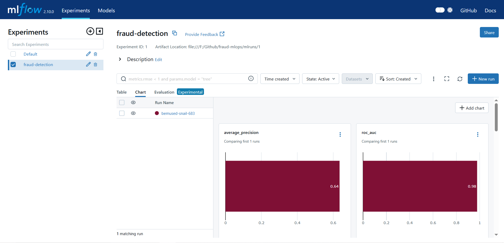
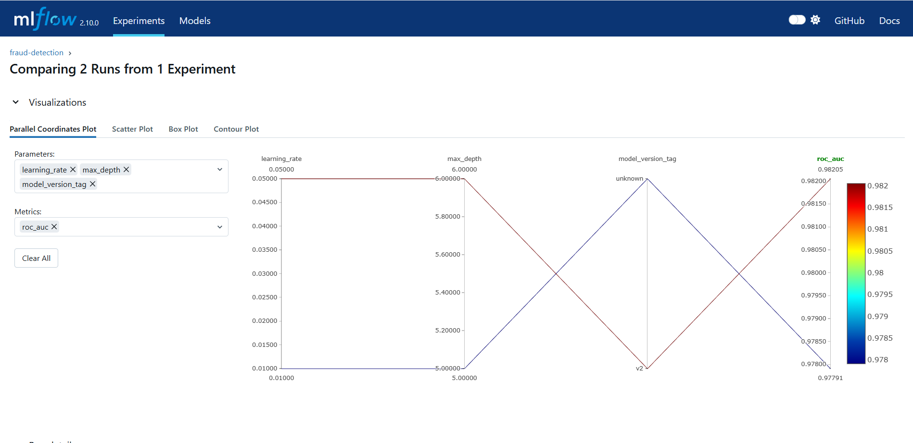
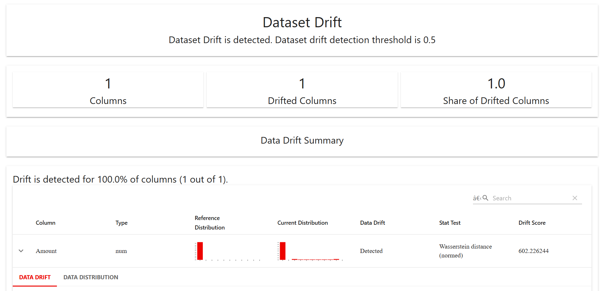
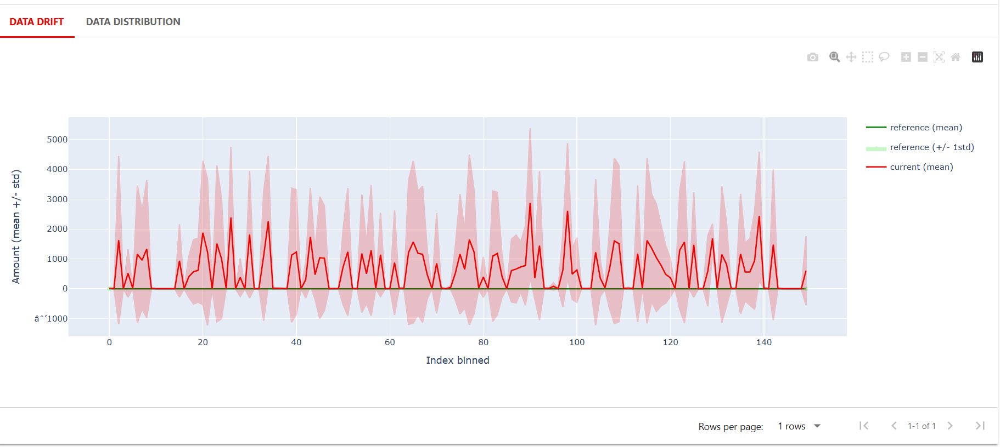

# Creditcard Fraud Detection MLOps Platform

[](https://github.com/AnjanaKvd/fraud-mlops/actions/workflows/ci.yml)
[](https://github.com/AnjanaKvd/fraud-mlops/actions/workflows/cd.yml)
[](https://fraud-mlops.onrender.com)
[](https://www.python.org/downloads/)
[](https://opensource.org/licenses/MIT)

> An end-to-end Machine Learning Operations (MLOps) system designed to detect fraudulent credit card transactions in real-time.

**The Business Context**: Credit card fraud costs the global financial sector over $32 billion annually. Detecting anomalies with high precision and low latency is critical to minimizing financial losses and ensuring customer trust without creating operational bottlenecks.

---

##  Architecture System Design



##  Core Features

- **Real-Time Inference API**: High-performance RESTful API built with FastAPI for serving real-time fraud predictions.
- **Experiment Tracking**: Integrated with **MLflow** for robust tracking of hyperparameters, model drift, and versioning.
- **Drift Monitoring**: Uses **Evidently AI** to automatically trigger alerts and orchestrate retraining when feature drift exceeds 30%.
- **Robust CI/CD Pipelines**: Automated testing and deployment workflows managed with **GitHub Actions**.
- **Reproducible Pipelines**: Data versioning and completely reproducible model training using **DVC**.
- **Containerized Environment**: Packaged with **Docker** & **Docker Compose** for seamless deployment across local and cloud environments.

##  Tech Stack & Tooling

| Category | Technologies |
| --- | --- |
| **Machine Learning** | XGBoost, Scikit-learn, Pandas |
| **Model Serving** | FastAPI, Uvicorn |
| **MLOps / Tooling** | MLflow, DVC, Evidently AI |
| **Infrastructure** | Docker, Docker Compose, Render |
| **CI/CD** | GitHub Actions |
| **Language** | Python 3.10+ |

##  Local Setup & Installation

Follow these steps to run the pipeline and the API locally:

1. **Clone the repository:**

   ```bash
   git clone https://github.com/AnjanaKvd/fraud-mlops.git
   cd fraud-mlops
   ```

2. **Set up the virtual environment:**

   ```bash
   python -m venv venv
   source venv/bin/activate  # On Windows: venv\Scripts\activate
   pip install -r requirements.txt
   ```

3. **Pull DVC Data (Optional if configured):**

   ```bash
   dvc pull
   ```

4. **Run the services using Docker Compose:**

   ```bash
   docker-compose up -d --build
   ```
   *This starts both the FastAPI application (Port 8000) and the MLflow Tracking Server (Port 5000).*

5. **Train the initial model:**

   ```bash
   python train/train_model.py
   ```

##  API Documentation

Base URL: `http://localhost:8000` (or `https://fraud-mlops.onrender.com` for production)

| Endpoint | Method | Description |
| --- | --- | --- |
| `/health` | `GET` | Health check to verify API availability |
| `/predict` | `POST` | Get fraud prediction for a given transaction |
| `/metrics` | `GET` | Expose Prometheus metrics |

### Example Request (`/predict`)

```bash
curl -X POST "http://localhost:8000/predict" \
     -H "Content-Type: application/json" \
     -d '{
       "features": [0.1, -1.2, 3.4],  # Note: A real request expects all required feature values
       "amount": 150.00
     }'
```

### Example Response

```json
{
  "prediction": 1,
  "confidence": 0.985,
  "status": "success"
}
```
*(Prediction `1` signifies Fraud, `0` signifies Legitimate).*

##  Experiment Tracking (MLflow)

All experiments, parameters, and resulting metrics are logged diligently with MLflow.
Using Kaggle's Credit Card Fraud Dataset (284,807 transactions, highly imbalanced at 0.172% fraud).

- **ROC-AUC**: ~0.97
- **Average Precision (PR-AUC)**: ~0.85

<!-- PLACEHOLDER FOR MLflow SCREENSHOT -->



##  Drift Monitoring & Retraining

We simulate data drift programmatically. When **Evidently AI** detects that over 30% of features have drifted significantly from the baseline distribution, a model retraining pipeline is triggered.

<!-- PLACEHOLDER FOR DRIFT MONITORING SCREENSHOT -->



##  Performance Benchmarks

Ensuring high throughput and minimum latency is critical.

| Metric | Measurement |
| --- | --- |
| **Requests per Second (RPS)** | X req/sec |
| **Average Latency** | X ms |
| **p50 Latency (Median)** | X ms |
| **p95 Latency** | X ms |
| **p99 Latency** | X ms |

*Note: p95/p99 latency tracking ensures that 99% of our transaction checks complete within strict SLA margins. I will fill in these exact benchmarks once finalized.*

##  Project Structure

```text
fraud-mlops/
├── .github/workflows/      # CI/CD pipelines
├── app/                    # FastAPI application layer & schemas
├── benchmarks/             # Load testing and latency measurements
├── data/                   # Raw and processed datasets (DVC managed)
├── images/                 # Assets (architecture diagrams, etc.)
├── monitor/                # Evidently AI drift simulation scripts
├── notebooks/              # Exploratory Data Analysis (EDA)
├── tests/                  # Unit and integration tests (pytest)
├── train/                  # Model training and optimization
├── .dvc/                   # DVC configuration
├── docker-compose.yml      # Multi-container orchestration
├── Dockerfile              # API container definition
└── requirements.txt        # Python dependencies
```

##  Key Decisions & What I Learned

- **Choosing XGBoost**: While Random Forests handle imbalanced data decently, XGBoost consistently yielded superior recall and PR-AUC with minimal tuning for this tabular dataset.
- **Serving Architecture**: I picked FastAPI coupled with Docker over a simple Flask application for its out-of-the-box asynchronous capabilities, which heavily improved baseline theoretical requests per second.
- **Drift Triggers**: Initially, setting drift sensitivity too high caused unnecessary retrains. Tuning evidently to a 30% feature shift baseline struck a better balance between computational cost and prediction consistency.

##  Future Improvements

- **Feature Store Integration**: Integrate `Feast` or `Hopsworks` for online/offline feature retrieval.
- **Advanced Serving**: Move towards `BentoML` or `Triton Inference Server` to support native batching and framework-agnostic serving.
- **Shadow Deployments**: Implement A/B testing or model shadowing directly inside the active deployment pipeline.

##  Contact

- **LinkedIn**: [AnjanaKvd on LinkedIn](https://linkedin.com/in/AnjanaKvd)  <!-- Update with actual link if different -->
- **GitHub**: [@AnjanaKvd](https://github.com/AnjanaKvd)
- **Email**: anjanakavid@gmail.com


<!-- PORTFOLIO_START -->
## Fraud Detection MLOps Pipeline
A brief, 1-2 sentence description of your project goes here. This will be grabbed as the card's main description. Make sure it doesn't start with a #.
### Tech Stack
- Python
- Docker
- MLflow
- FastAPI
- Scikit-learn
- GitHub Actions
### Features
- End-to-end model training pipeline
- Real-time inference via REST API
- Automated retraining triggers
- Data drift monitoring and alerting
- Production-ready containerization
### Preview

### Links
- Live: https://fraud-mlops-demo.herokuapp.com
- Repo: https://github.com/AnjanaKvd/fraud-mlops
<!-- PORTFOLIO_END -->
